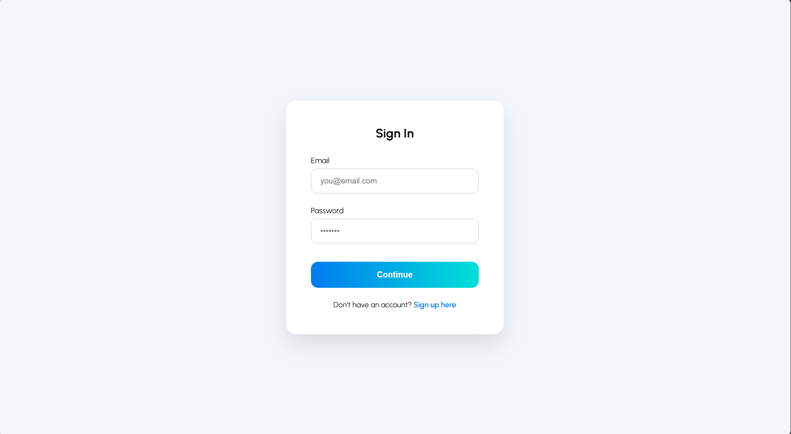

# LightDark-In (Copilot)

"LightDark-In" is a sleek and modern authentication interface that seamlessly blends aesthetic design with dynamic theming. It offers users a frictionless sign-in/sign-up experience while shifting the entire UI between light mode and dark mode depending on the user’s flow—with buttery smooth transitions that elevate the visual journey.

## Live Project :
https://aicomp-sketch.github.io/LightDark-In/Source%20Code/
